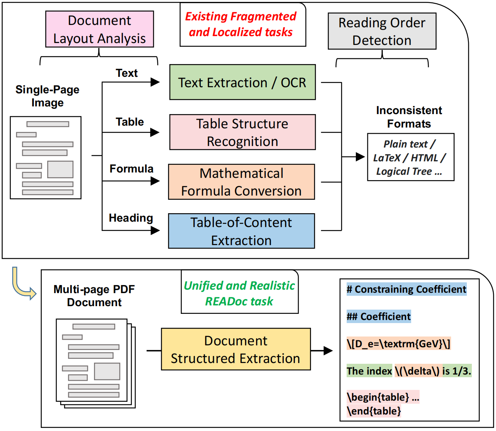
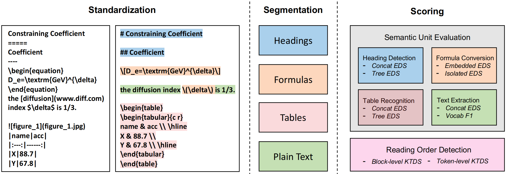

# 📖 READoc
📄 [Paper](https://www.arxiv.org/abs/2409.05137) | 🥇[Leadboard](https://huggingface.co/spaces/) | 🤗 [Data](https://huggingface.co/datasets/lazyc/READoc) | *Current Version: v0.1*

This repository contains the code to evaluate models or tools on READoc from the paper [READoc: A Unified Benchmark for Realistic Document Structured Extraction](https://arxiv.org/abs/2409.05137).

## 📜 About

Document Structured Extraction (DSE) aims to extract structured content from raw documents. Despite the emergence of numerous DSE systems (e.g. Marker, Nougat, GPT-4), their unified evaluation remains inadequate, significantly hindering the field’s advancement. This problem is largely attributed to existing benchmark paradigms, which exhibit fragmented and localized characteristics. To address these limitations and offer a thorough evaluation of DSE systems, we introduce a novel benchmark named READoc, which defines DSE as a realistic task of converting unstructured PDFs into semantically rich Markdown. The READoc dataset is derived from 2,233 diverse and real-world documents from arXiv and GitHub. In addition, we develop a DSE Evaluation Suite comprising Standardization, Segmentation and Scoring modules, to conduct a unified evaluation of state-of-the-art DSE approaches. By evaluating a range of pipeline tools, expert visual models, and general VLMs, we identify the gap between current work and the unified, realistic DSE objective for the first time. We aspire that READoc will catalyze future research in DSE, fostering more comprehensive and practical solutions.



A comparison between previous fragmented and localized DSE task views and the READoc benchmark paradigm is shown as the above.


## 🛠️ Evaluate Your DSE Systems

### Environment Setup


To start, please follow the steps below to prepare the environment:

First, you need to have Pandoc installed in your environment. You can install it by running `conda install -c conda-forge pandoc`, or follow the instructions on [Pandoc's official website](https://pandoc.org/installing.html).

Next, you can run the following commands.

``` bash
git clone https://github.com/lazyc81/READoc.git
cd READoc
pip install -r requirements.txt
```

Please note that this environment only includes the basic libraries for document reading and evaluation. If you want to implement the provided DSE system, you will need to configure the environment according to the link provided below.

* [pymupdf4llm](https://pymupdf.readthedocs.io/en/latest/pymupdf4llm/)
* [marker](https://github.com/VikParuchuri/marker)
* [nougat](https://github.com/facebookresearch/nougat)
* [internvl-chat-v1-5](https://huggingface.co/OpenGVLab/InternVL-Chat-V1-5)
* [gpt-4o-mini](https://platform.openai.com/docs/models/gpt-4o-mini)


### Data Preparation

READoc consists of 2,233 documents: 1,009 in the READoc-arXiv subset and 1,224 in the READoc-GitHub subset. Each subset offers unique challenges: READoc-arXiv features complex academic structures such as formulas and tables, with diverse multi-column layout templates. However, its heading styles are simple, often following easily recognizable patterns like “1.1 Introduction.” In contrast, READoc-GitHub includes only basic elements like paragraphs and headings, and presents a uniform single-column layout style.


*Please note that we have not yet released the full dataset; For now, we are providing a few sample documents in the `data` directory as a reference.*

*If you have an urgent need to evaluate and obtain experimental results for your DSE system, the complete set of PDFs is available on [huggingface](https://huggingface.co/datasets/lazyc/READoc). You can send me the Markdown files generated by you DSE systems, and I will calculate the evaluation scores for you. This evaluation flow will be improved in the future.*


### PDF to Markdown Process

In our paper, we evaluated DSE systems from diverse sources, including commonly used simple baselines, pipeline tools composed of deep learning model ensembles, expert visual models, and both open-source and closed-source large vision-language models (VLMs). 
Here, we implemented representative DSE systems from each category, which can be evaluated using the following method. 


``` 
SYSTEM=[pymupdf4llm|marker|nougat|internvl-chat-v1-5|gpt-4o-mini] SUBSET=[arxiv|github] bash scripts/pdf_to_markdown.sh
```

Please note that for evaluating VLMs, we used a single-page image-to-markdown approach and designed different prompts for two types of documents. More novel DSE paradigms can be explored independently.


### Evaluation Process

Our evaluation Suite includes three sequential modules: Standardization, Segmentation, Scoring. The evaluation process can be conducted with a single command using the instruction below.

``` 
SYSTEM=[pymupdf4llm|marker|nougat|internvl-chat-v1-5|gpt-4o-mini] SUBSET=[arxiv|github] bash scripts/evaluation.sh
```



The overall process of the evaluation Suite is shown as the above.


## 🥺 Citation
If you use our work and are inspired by our work, please consider cite us:

``` bibtex

```